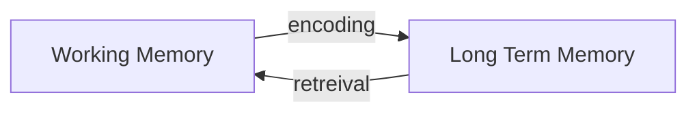

## como a memória funciona

**Informação Sensorial**: toda e qualquer tipo de informação captada pelos sentidos. Vídeos, áudio, imagens, textos, etc.

**Memória Sensorial**: a informação sensorial ja  processada absorvida pelo nosso cérebro.

O processamento da informação sensorial em memória sensorial é muito rápido, fazendo com tudo que seja relevante seja descartado e tudo que seja útil seja mandado para a *working memory*.

**Working Memory**: Memórias sensoriais 
relevantes e práticas, como: 
- dados importantes 
- lista de compras que anotamos na cabeça
- um fato interessante que experienciou, etc.

**Encoding**: o processo de passar a informação da *working memory* para a *long term memory*. ^34f271

**Long Term Memory**: informações que nosso cérebro considera relevante e ficam gravadas em nossa mente.

O processo de recuperar a informação é chamado de *retrieval*, onde a informação que estava na long term memory volta novamente pra working memory,  onde podemos usa-la.

## O grande problema
muitos estudantes tem dificuldade nesse ciclo

Não sabemos exatamente como fazer um bom *encoding* e com isso a quantidade de informação que podemos recuperar é menor.
Digamos que dos 100% do conteúdo que aprendemos, conseguimos aproveitar 50%. Essa informação passa pelo processo de *encoding* e vai para a *long term memory*. Os outro 50% devemos reaprender, o que significa passar pelo mesmo processo: 

Info Sens -> Memo Sens -> Wrk Memo -> LTM

Com isso perdemos o dobro do tempo ou até mais estudando a mesma coisa. Quando se tem pouco volume de conteúdo isso não se torna um problema tão grave, mas em quantidades de maçantes de conteúdo, como em faculdades, isso acaba tomando um tempo valioso da nossa vida.

Esse processo é puramente cognitívo, tudo acontece em nosso cérebro, o que gera um certo desconforto. Isso é bom, esse dificuldade significa que nosso cérebro esta se forçando para processara informação e com isso nossa taxa de aprendizado será maior.

Um estudo fácil é satisfatório e nos da a sensação de aprendizado, mas na prática isso indica pouco *encoding* e *retrieval* que resulta em pouco aprendizado.

## Como conseguir um bom aprendizado?
como vimos anteriormente, aprendizado = altos níveis de *encoding* e *retrieval* e pra atingir isso devemos entender as **OS 3 PILARES DO APRENDIZADO**
toda técnica aprendida abrange um desses pilares.
**SPACING** -> espaçar os períodos de [[como fazer revisões]] 
**INTERLEAVING** -> usar a informação sobre algo em diferentes ângulos 
**RETRIEVAL** -> pegar informações da *long term memory* e mandar para a  *working memory*